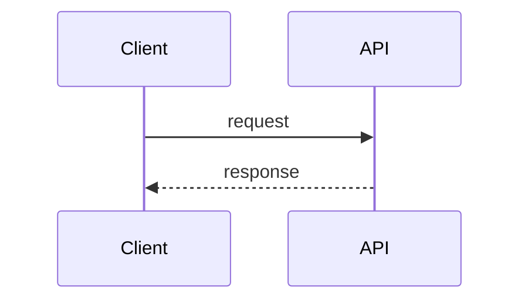

# Bug

## Trigger Gate

Run this skill only when the user includes `#bug`.

If the token is not present, do not run this workflow.

## Command Format

`#bug <complete bug context>`

Use everything after `#bug` as bug context: symptoms, logs, stacktrace, expected vs actual behavior, scope, environment, frequency, and impact.

## Goal

Produce a planning-only bug investigation package that is ready for later execution.

This skill must analyze the bug, define the fix strategy, and write the planning artifacts. It must not implement the fix.

## Hard Constraint: Planning Only

This skill is for planning, not execution.

- Do not write production code.
- Do not write or modify tests.
- Do not run implementation tasks.
- Do not partially fix the bug.
- Do not behave like `#task-exec`.

Allowed work:

- inspect the repository
- read relevant files
- analyze evidence
- form hypotheses
- define scope
- write PRD, task list, and task-level technical planning when needed

## Planning Workspace

All bug-planning artifacts must be written under:

`.ai/feature/<task-name>/`

Use a short, filesystem-safe kebab-case task name derived from the bug context.

Required files:

- `.ai/feature/<task-name>/prd.md`
- `.ai/feature/<task-name>/tasks.yml`

Conditional directory:

- `.ai/feature/<task-name>/tasks-planning/` when one or more tasks need deeper technical refinement before execution

Do not write the planning output anywhere else unless the repository has an explicit local override that instructs otherwise.

## Workflow

1. If `project/ai/agents/bug.md` exists at repository root, read and follow it first.
2. If `.ai/setup/project-structure.md` exists, read it and use it as guidance.
3. Derive `<task-name>` from the bug context.
4. Ensure `.ai/feature/<task-name>/` exists.
5. Reset workflow context before analysis by overwriting these files from zero:
   - `.ai/feature/<task-name>/prd.md`
   - `.ai/feature/<task-name>/tasks.yml`
6. Normalize the bug statement:
    - expected behavior
    - actual behavior
    - impact and severity
    - affected users or flows
    - reproducibility (always, intermittent, unknown)
7. Triage with evidence only:
    - inspect the most relevant code paths
    - collect the strongest evidence first (errors, logs, failing flow, recent changes)
    - narrow the likely layer (API, service, domain logic, persistence, integration, infra/config)
8. Build a hypothesis list and prioritize by probability x impact x verification cost.
9. Convert the investigation into planning artifacts:
    - write `prd.md` from scratch with bug context, scope, root-cause hypothesis, acceptance criteria, risks, and validation strategy
    - write `tasks.yml` from scratch with the minimum set of implementation tasks needed to fix and validate the bug
    - if one task is enough, create only one task
    - include `test_strategy` for each task, but do not implement the tests in this skill
10. When the bug requires deeper task-by-task technical refinement, create `.ai/feature/<task-name>/tasks-planning/<selector>.md` files.

## `tasks-planning` Requirements

`tasks-planning` is an optional technical refinement layer for complex work.

Create task-planning files when at least one task needs implementation guidance beyond what fits well in `tasks.yml`, especially for integration-heavy, multi-step, high-risk, or edge-case-sensitive fixes.

Use one file per task, named by a stable selector that `#task-exec` can map back to the task, such as:

- `.ai/feature/<task-name>/tasks-planning/1.md`
- `.ai/feature/<task-name>/tasks-planning/T-2.md`

Follow this structure closely:

1. `# Task <selector> - <title>`
2. `## Objetivo`
3. `## Fluxo detalhado`
4. `## Criterios de aceite`
5. `## Diagrama Mermaid` when it materially helps the execution flow
6. `## Endpoint com cURL` only when the task touches an API contract or endpoint behavior
7. `## Notas`

Rules for `tasks-planning/*.md`:

- Keep the content purely technical and execution-oriented.
- Refine the task with concrete flow sequencing, state transitions, invariants, dependencies, data touchpoints, and failure handling.
- Explore edge cases, idempotency, retries, concurrency, partial failure, backward compatibility, observability, and rollback implications whenever relevant.
- Prefer practical details that reduce implementation ambiguity for `#task-exec`.
- Do not create `Endpoint com cURL` when the task does not touch an API.
- Use a consistent technical planning style like this:

```md
# Task 1 - Concise technical title

## Objetivo

Describe the technical outcome the task must deliver.

## Fluxo detalhado

1. Describe the main execution path in sequence.
2. Call out validations, persistence, integrations, and state changes.
3. Include failure branches or idempotency points when relevant.

## Criterios de aceite

- observable technical outcomes
- persisted states or side effects
- contract or behavior guarantees

## Diagrama Mermaid



## Endpoint com cURL

Include only when the task touches an API.

```bash
curl -X POST "https://api.example.com/resource" \
  -H "Authorization: Bearer <token>" \
  -H "Content-Type: application/json" \
  -d '{
    "example": true
  }'
```

## Notas

- list dependencies
- list edge cases
- list technical constraints for execution
```

## Performance Rules

- Prefer targeted search (`rg`, focused file reads) over broad scanning.
- Prefer the smallest evidence set that supports a solid plan.
- Prefer the smallest fix strategy that satisfies acceptance criteria.
- Stop early on disproven hypotheses and record them to avoid repeated work.

## Output Contract

- Planning artifacts are ready for later execution by `#task-exec`.
- The output is written under `.ai/feature/<task-name>/...`.
- `tasks-planning/*.md` exists for tasks that need deeper technical refinement.
- Include a clear recommended selector for the next command, for example `#task-exec 1` or `#task-exec T-2`.

## Rules

- This skill must never implement the bug fix.
- This skill must never create or edit production code or tests as part of execution.
- If bug context is missing after `#bug`, ask for complete context.
- Keep analysis pragmatic and directly tied to bug resolution.
- Be a senior engineer with years of experience, balancing quality and simplicity.
- Never reuse previous PRD or tasks context for this command.
- Be aware of performance, reliability, observability, accessibility, maintainability, privacy, and security.

## Reference Sources

Use these sources only when they materially improve the quality of the plan. Be pragmatic.

- Refactoring / clean code: https://refactoring.guru
- Architecture & design: https://martinfowler.com
- Microservices: https://microservices.io
- API design: https://google.aip.dev
- Security: https://owasp.org
- 12-factor apps: https://12factor.net
- System design fundamentals: https://systemdesign.one
- System design fundamentals: https://bytebytego.com
