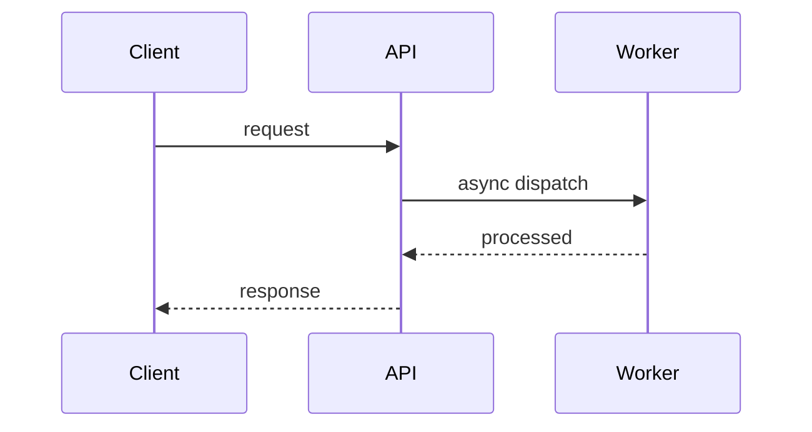

# PRD Plan

## Trigger Gate

Run this skill only when the user includes `#prd-plan`.

If the token is not present, do not run this workflow.

## Command Format

`#prd-plan <contexto geral>`

Use everything after `#prd-plan` as planning context.

If context is missing after `#prd-plan`, ask for the context text.

## Goal

Produce a planning-only package from business context that is ready for later execution.

This skill must analyze the requested change, define scope, and write the planning artifacts that `#task-exec` can consume.

## Hard Constraint: Planning Only

This skill is for planning, not execution.

- Do not write production code.
- Do not write or modify tests.
- Do not run implementation tasks.
- Do not behave like `#task-exec`.

Allowed work:

- inspect the repository
- read relevant files
- analyze business and technical context
- define scope and task slicing
- write PRD, task list, questions, and task-level technical planning when needed

## Planning Workspace

Follow the same workflow structure used by `bug.md` and `task-exec.md` so the output is executable later.

All planning artifacts must be written under:

`.ai/feature/<task-name>/`

Use a short, filesystem-safe kebab-case task name derived from the planning context.

Required files:

- `.ai/feature/<task-name>/prd.md`
- `.ai/feature/<task-name>/tasks.yml`

Conditional file:

- `.ai/feature/<task-name>/questions.yml` when planning reveals questions that block, narrow, or materially reshape the refinement

Conditional directory:

- `.ai/feature/<task-name>/tasks-planning/` when one or more tasks need deeper technical refinement before execution

## `questions.yml` Contract

When planning uncovers missing business decisions, assumptions that are too risky, or ambiguities that materially change scope, create `.ai/feature/<task-name>/questions.yml`.

Use a structure like:

```yml
questions:
  - id: Q01
    title: Short question title
    criticality: P0
    question: >-
      Direct question for the stakeholder.
    context: >-
      Why this matters, what part of the design it changes, and what risk exists if unanswered.
    answer: Optional stakeholder answer
```

Rules for `questions.yml`:

- Use stable ids like `Q01`, `Q02`, `Q03`.
- Use `criticality` with `P0`, `P1`, or `P2`.
- Keep each question decision-oriented, not open-ended discovery fluff.
- Always explain the planning impact in `context`.
- Add `answer` only when the stakeholder has already provided one.
- Prefer a short, high-signal list of questions that actually affect the plan.
- If no material questions exist, do not create `questions.yml`.
- If `questions.yml` already exists, treat it as planning input and preserve answered items while updating unresolved or newly discovered ones.

## Workflow

1. If `.ai/setup/project-structure.md` exists, read it and use it as guidance.
2. Derive `<task-name>` from the business context.
3. Ensure `.ai/feature/<task-name>/` exists.
4. If `.ai/feature/<task-name>/questions.yml` already exists, read it before rebuilding the plan and treat all answered questions as authoritative planning input for this run.
5. Reset workflow context before planning by overwriting these files from zero:
   - `.ai/feature/<task-name>/prd.md`
   - `.ai/feature/<task-name>/tasks.yml`
6. Normalize the request context:
    - problema de negocio
    - objetivo
    - usuarios ou fluxos afetados
    - restricoes, dependencias, ou contexto operacional
7. Identify planning questions that are still open after reading the user context and any existing `questions.yml` answers.
8. Build or refresh `.ai/feature/<task-name>/questions.yml` when those questions materially affect scope, sequencing, acceptance criteria, contracts, rollout, or operational design.
9. Build `prd.md` from scratch with:
    - problema de negocio
    - objetivo
    - escopo e nao-escopo
    - criterios de aceite
    - riscos e dependencias
    - estrategia de testes (TDD) por criterio de aceite
10. When answered questions exist, reorganize the refinement around those answers instead of keeping the previous assumption-based shape.
11. Build `tasks.yml` from scratch with context-oriented tasks that are PR-oriented:
    - `id`
    - `title`
    - `status: todo`
    - `repositories`
    - `pr_scope`
    - `acceptance_criteria`
    - `dependencies`
    - `test_strategy`
12. For complex work, write per-task technical refinements under `.ai/feature/<task-name>/tasks-planning/` using the static structure defined in this document.
13. Make the result clearly executable by `#task-exec`, including a recommended next command such as `#task-exec 1` when the plan is actionable.
14. If unresolved P0 questions remain, mark the planning result as partially blocked and direct the user to answer `questions.yml` before expecting final refinement quality.

## Task Slicing Rules (PR-Oriented)

- Organize tasks by delivery context, where each task should preferably map to one PR.
- Keep in the same task everything that belongs to the same context or flow, even if it touches multiple files.
- Prefer one repository per task so `1 task = 1 PR` stays practical.
- If the context impacts multiple repositories, split into coordinated tasks by repository while preserving the same context name or purpose.
- Split into more tasks only when scope becomes too large or risky for one PR, or when contexts are clearly independent.
- Every task must explicitly list the target repositories in `repositories`.
- Prefer 3-6 high-signal tasks over many micro-tasks.

## Test Planning Rules (TDD)

- Plan test-first execution for every task: tests first, then implementation.
- Define the minimum test set that proves behavior without redundant overlap with existing coverage.
- Prefer integration tests for important DB-backed flows, transactions, persistence rules, or query behavior.
- If DB integration is not central, create only a lean integration slice with happy path and sad path validation.
- Prefer unit tests for business logic and calculations when behavior does not depend on DB internals.
- Map each acceptance criterion to explicit tests in `prd.md` or `tasks.yml`.

## `tasks-planning` Requirements

`tasks-planning` is the optional deep technical planning layer for complex tasks.

Create task-planning files when the task needs more detail than `tasks.yml` can express safely, especially for:

- multi-step backend flows
- external integrations
- async processing
- state machines or status transitions
- migrations or persistence-sensitive behavior
- authorization or policy-heavy flows
- high-risk edge cases

Use one file per task with a stable selector filename, such as `1.md` or `T-2.md`.

Follow this structure closely:

1. `# Task <selector> - <title>`
2. `## Objetivo`
3. `## Fluxo detalhado`
4. `## Criterios de aceite`
5. `## Diagrama Mermaid` when it materially helps execution
6. `## Endpoint com cURL` only when the task touches an API contract or endpoint behavior
7. `## Notas`

Rules for `tasks-planning/*.md`:

- Keep the file purely technical; do not repeat business narrative unnecessarily.
- Refine sequencing, components touched, inputs/outputs, persistence effects, side effects, and validation expectations.
- Explore edge cases and technical failure modes deeply.
- Document idempotency, retries, locking/concurrency, consistency boundaries, auditability, observability, and backward compatibility whenever relevant.
- Use representative endpoint examples only when an API is involved.
- Keep the content directly actionable by `#task-exec`.

Example shape:

```md
# Task 1 - Concise technical title

## Objetivo

Describe the technical outcome the task must deliver.

## Fluxo detalhado

1. Describe the main execution path in sequence.
2. Call out validations, persistence, integrations, state transitions, and async boundaries.
3. Include unhappy paths, retries, and idempotency points when relevant.

## Criterios de aceite

- observable technical outcomes
- persisted states or side effects
- contract or behavior guarantees

## Diagrama Mermaid



## Endpoint com cURL

Include only when the task touches an API.

```bash
curl -X POST "https://api.example.com/resource" \
  -H "Authorization: Bearer <token>" \
  -H "Content-Type: application/json" \
  -d '{
    "example": true
  }'
```

## Notas

- dependencies
- edge cases
- operational constraints
- follow-up technical caveats
```

## Output Contract

- Planning artifacts are ready for later execution by `#task-exec`.
- The output is written under `.ai/feature/<task-name>/...`.
- `tasks.yml` is structured so a single selector can be resolved by `#task-exec`.
- `questions.yml` is created when material open questions exist and reused as input on later `#prd-plan` runs.
- `tasks-planning/*.md` is created for tasks that need deeper technical refinement.

## Rules

- Do not execute implementation tasks.
- Do not mark tasks as done in this phase.
- Rebuild PRD and tasks from scratch for each run, and refresh `questions.yml` when needed, but do reuse stakeholder answers from `questions.yml` when present.
- Keep the plan pragmatic, reviewable, and directly tied to business value.
- Be aware of performance, reliability, observability, accessibility, maintainability, privacy, and security.
